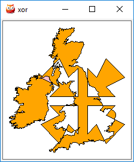

# Generic Polygon Clipper

Alan Murta of Manchester University, United Kingdom, wrote a very useful
[generic two-dimensional polygon clipper][gpc]. Cheers Alan. Nice work. This is
a Prolog wrapper for his GPC tool.

[gpc]:http://www.cs.man.ac.uk/~toby/alan/software/gpc.html

## Too long; didn't read

```prolog
1 ?- [library(gpc/demos)].
true.

2 ?- britain_arrows(xor).
true.
```



## Polygon types in Prolog

Implements polygons as mutable BLOBs. Tempting to make a purely
functional interface with no side effects. However, the underlying
implementation maintains mutable polygon entities. Decision is to
include pure functional predicates (side-effect free) using arity.

Mutability makes some assumptions about threading. Polygons are *not* thread
safe. Provide suitable atomic locking, e.g. using [mutexes][threadsync], if you
want to synchronise access to the same polygon across multiple threads.

[threadsync]:http://www.swi-prolog.org/pldoc/man?section=threadsync

## External and hole contours

The underlying interface uses a flag to indicate the difference
in-between external or internal contours. The Prolog implementation here uses
external and hole functors with a single list argument comprising `vertex(X, Y)`
elements.

## Modifications to the GPC sources

There are no modifications, except to substitute standard memory
allocation requests for Prolog allocations. The GPC sources do not permit
a redefinition. Consequently, it now also includes the SWI-Prolog header.

The GPC code also uses `fscanf()` while ignoring the return value. In other
words, it ignores errors and could fail by seeing random stack-based values that
do not represent true scanned values. Worked around this by quieting the warning
(`unused-result`) but also by avoiding use of the `gpc_read_polygon()`
function.

## Building and testing

Note that you can easily attach the pack, build and run it directly from a local
repo clone using the following queries. These work on Windows, Mac and Linux.
Change `~/Documents/GitHub` to wherever you have cloned the repo; the parent
folder, not the repo folder itself.

```prolog
?- expand_file_name('~/Documents/GitHub', [Packs]), attach_packs(Packs).
?- pack_rebuild(gpc).
?- [library(gpc)].
?- load_test_files([]).
?- run_tests.
```
